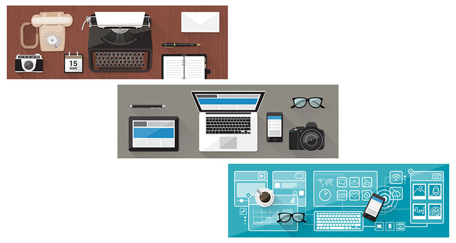
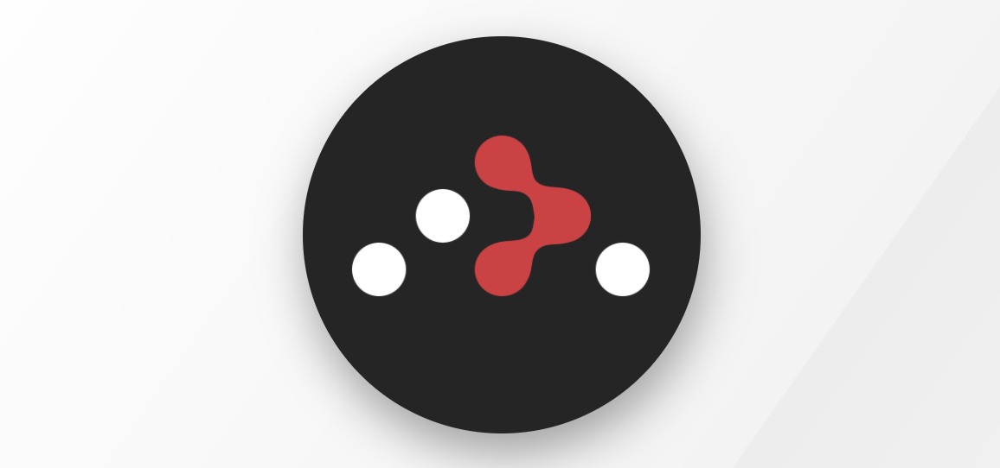

# 🌑 📜 ✂️

# Rock Paper Scissors Evolution

## School of Code Week 1 Day 5

### What do 🤔

During School of Code Hackathons are done to exercise what we have learned and practice using it.

This is what we had to do for the first Hackathon of creating a Rock Paper Scissors game.

This task was to help with using basic HTML and vanilla JS.
It focused on dom manipulation to display the relevate information.

We also had to use functions to generate the computers random move. As well as statements to monitor the scoring generating a response when got to a specific number.

### Version 1 - Hackathon

This isn't actually what I manage to accomplish by the end of that day/week one (I struggled a bit 😢)

Me and my partner manage to get the concept of the game working but only in the console as messages.

I went back to the hackathon on occasion and atleast completed the main concept of it so the result are displayed on the screen (with the dom manipulation).

### Version 2 - HTML CSS JS

This differs from before as player can pick from the options with buttons for each one instead of having to type it into an input field. This improvement makes it more playable and easier to follow.

I have also styled this version with better css, background image and media queries for use on different devices.

### Version 3 - React

This version I converted the previous into React using some of the same logic but I did have to change the JS to JSX and use states in order for the game and code to function in a cleaner and better way.

### Rock Paper Scissors Evolution

I combined all the versions into one project making this a cool way of being able to track my own progress, skills and knowledge.

#### Making this

For general app construction
 
React
 

 
For navigating through the app
React Router Dom
 

 
For some framework css help
Bootstrap

